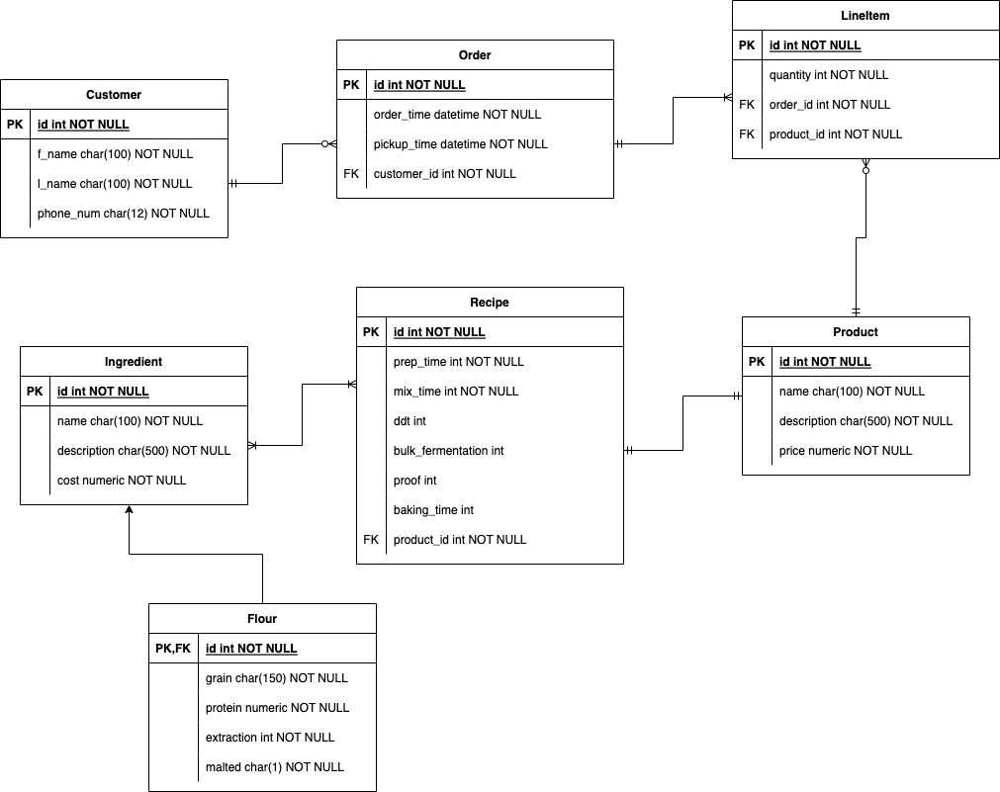

# Microbakery Managment Software (WIP)

## Bakery API

Main project - https://github.com/scottross123/microbakery-management-software

## Objective

Backend API for the microbakery project that I wanted to continue working on without worrying about the frontend. Will totally redo frontend at some point. Want to learn more about backend development and Spring.

## Schema

Gonna do a lot of this over at some point, and add tables for Addresses, Supplier, etc.

## Technologies
 - Java 18
 - Spring Boot Web
 - Spring Boot Data JPA
 - Maven
 - Hibernate
 - PostgreSQL
 - Heroku

## Installation 

Build a JAR file using `mvn install clean` which will bundle the file in the directory `target`.
Then run `java -jar microbakery-0.0.1-SNAPSHOT.jar` to run it.

## Todo
- Finish adding/updating records through client
- Expand on current schema, add new relations and tables
- Recipe builder
- ***Add unit and integration tests for both fronend and backend!***
- Redo frontend

## Future Plans
- Add log in system and user authentication with Spring Security
- Add dashboard pages with graphs based on table data
- Add more pages beyond basic crud tables
